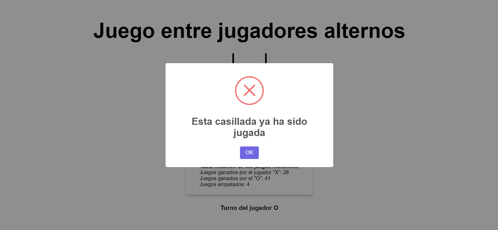

# Versión de React & Symfony del popular juego Tic-Tac-Toe o Tres en Raya
## 1.	Introducción
### 1.1 Frontend
1. El FrontEnd está diseñado con React para las peticiones a la API y SweetAlert2 para mostrar 
las notificaciones.
2. En React se usan componentes funcionales y Hooks para el manejo de estados.

### 1.2 Backend 
1. El Backend está diseñado con Symfony para la gestión de toda la lógica 
del juego. 
2. En el Backend se separa la lógica en las siguientes capas: 
Entidades, Controladores, Repositorios y Servicios. Esto ayuda a una mejor separación 
de responsabilidades, mejor testeabilidad, mayor reutilización de código y por ende
es más fácil de refactorizar y escalar.
3. Adicionalmente se usa un Trait que nos facilitará la vida en los Mock de los Tests.

### 1.3 Nota adicional
1. Para la versión del juego contra la computadora se hizo una adaptación a PHP 
del algoritmo de AI conocido como Minimax (`AIGameService.php` ):
> Con cada jugada del jugador humano la AI sigue jugando adelante hasta que alcanza 
> una disposición terminal del tablero (estado terminal) que resulta en un empate, 
> una victoria o una pérdida. Una vez en un estado terminal, la AI asignará un 
> puntaje positivo arbitrario (+10) para una victoria, un puntaje negativo (-10) 
> para una pérdida o un puntaje neutral (0) para un empate.
> 
> Al mismo tiempo, el algoritmo evalúa los movimientos que conducen a un estado 
> terminal en función del turno de los jugadores. Elegirá el movimiento con la 
> puntuación máxima cuando sea el turno de la AI y elegirá el movimiento con la 
> puntuación mínima cuando sea el turno del jugador humano. Usando esta estrategia,
> Minimax evita perder con el jugador humano.
2. La AI siempre juega en este caso con "O" y el jugador notará que demora un poco más
por el proceso de análisis de la misma.

## 2. Instrucciones para el uso de la aplicación
1. En la pantalla inicial se muestran dos botones; el primero de izquierda a derecha
   es para crear un nuevo juego entre jugadores alternos en la misma pc, y el segundo es
   para crear un nuevo juego de un jugador(*en este caso el jugador X*) contra la computadora
   (*en este caso el jugador O*).

   

2. Una vez que se inicie el juego, en cualquiera de sus dos modalidades se mostrará
una notificación como la de la siguiente imagen indicando que ya un nuevo juego fue
persistido en la base de datos.


3. A medida que se va jugando se puede ver en la parte inferior del tablero de juego
un resumen del desempeño histórico de ambos jugadores e inmediatamente debajo el turno
del jugador actual. Todo esto se actualiza en tiempo real.
   

4. Una vez que termina el juego, se muestra una notificación indicando que el juego
finalizó con el resultado del mismo y si encima de este resultado se intenta jugar nos
lanza un error:


4.1 Si nos fijamos una vez que finaliza un juego aparece un botón al final de la página
para volver a jugar el cual nos llevará a la pantalla inicial.

5. Si intentamos jugar una casilla por segunda vez nos lanza un error:
   

### Requisitos mínimos del sistema operativo para desplegar la aplicación
* PHP >= 7.4.6
* Composer >= 2.0.13
* NodeJS >= 14.17.1 || Yarn >= 1.22.17 (Recomendado)

* MariaDB >= 10.4.11
* Apache >= 2.4.43

### Instrucciones para el despliegue de la aplicación
1. Crear una Base de Datos llamada: test_hiberus
2. Nos ubicamos en la carpeta raíz de la aplicación y corremos el comando:```composer install```